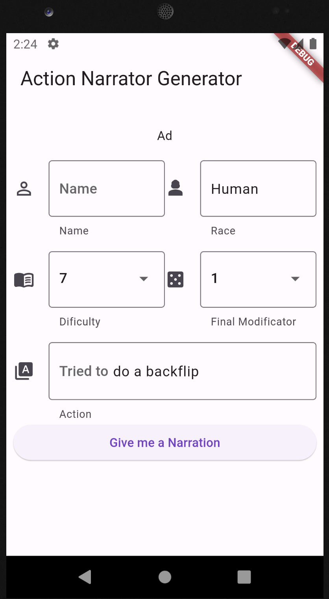

# ActionArtisan  App

The ActionArtisan app is a tool designed to assist Dungeon Masters (DMs) in creating vivid and immersive descriptions for various actions and scenarios in their tabletop role-playing games. This app leverages the power of OpenAI's natural language generation to provide dynamic and creative narratives that enhance the gaming experience.

 <!-- Replace with an actual screenshot of your app -->

## Features

- Generate Descriptions: Quickly create rich descriptions for player actions, combat sequences, environments, and more.
- Seamless Integration: The app's frontend is developed using Flutter, ensuring a smooth and intuitive user experience on both Android and iOS platforms.
- AI-powered Narration: The app communicates with a AWS Lambda function through API Gateway, which then interacts with an OpenAI API to retrieve narrations based on the input.
- Customizable Narratives: Tailor the generated narratives by providing specific details, tones, or styles, enhancing the uniqueness of your storytelling.

## Installation

1. Clone this repository: `git clone https://github.com/bepitic/ActionArtisan.git`
2. Navigate to the `dungeon-describer` directory: `cd dungeon-describer`
3. Install dependencies: `flutter pub get`
4. Run the app: `flutter run`

## Usage

1. Launch the app on your Android or iOS device.
2. Select the type of description you want to create (e.g., action, environment, dialogue).
3. Provide any relevant context or details.
4. Tap the "Generate" button.
5. The app will send a request to the serverless backend, which communicates with OpenAI's API.
6. Once the narration is received, it will be displayed on the screen.
7. Customize the narration further or use it as-is in your game.

## Backend Configuration

The app's backend is powered by AWS Lambda and API Gateway, which communicate with OpenAI's API to generate narrations. Make sure to set up the backend by following these steps:

1. Create an AWS Lambda function that handles the API Gateway requests. You can find a sample Lambda function in the `backend/lambda` directory.
2. Set up an API Gateway with appropriate routes and methods to trigger the Lambda function.
3. Obtain an API key or authentication token from OpenAI for making requests to their API.
4. Configure the app's frontend to send requests to the API Gateway endpoint, including the necessary authentication.

## Credits

- Flutter: [https://flutter.dev/](https://flutter.dev/)
- OpenAI: [https://openai.com/](https://openai.com/)

## License

This project is licensed under the [MIT License](LICENSE).
